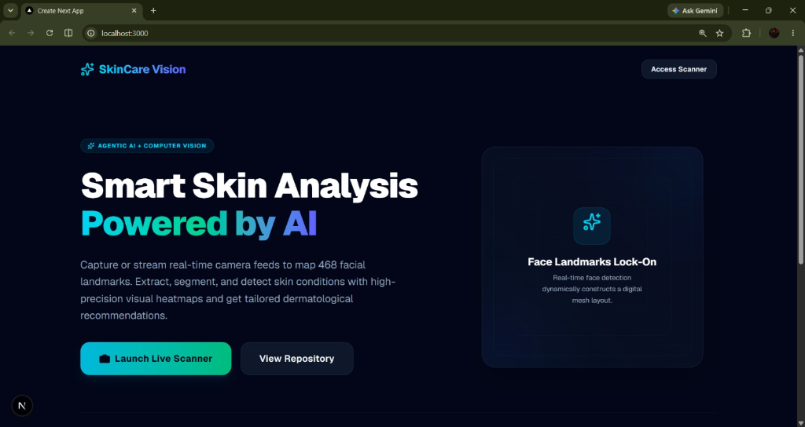
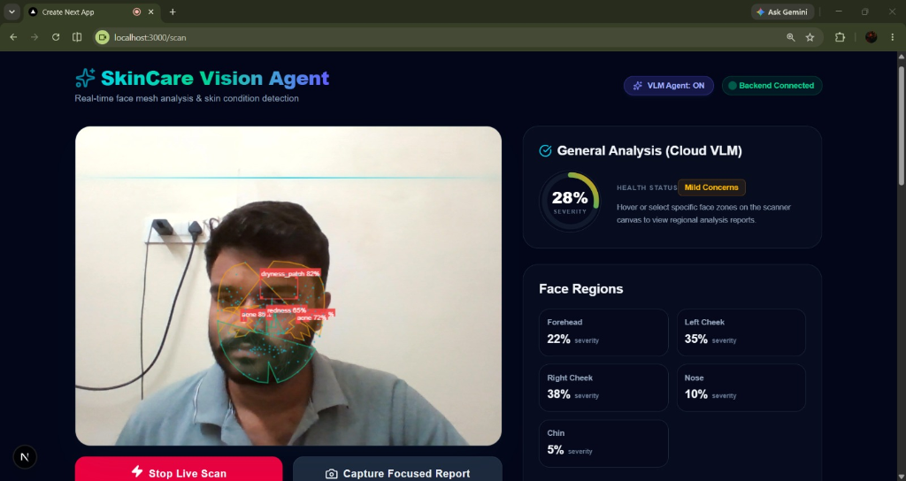
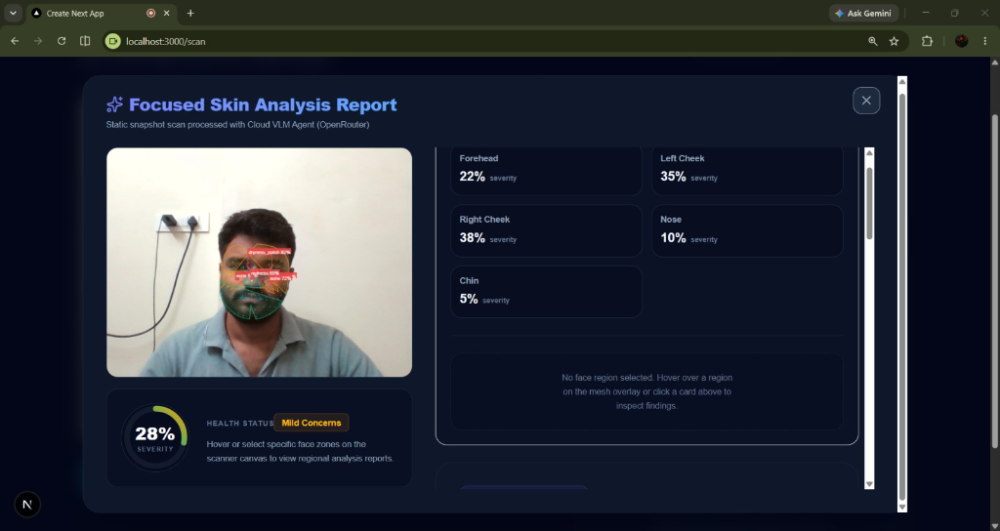

<div align="center">

# 🧬 SkinCare Vision Agent

**Real-time AI skin analysis system powered by fine-tuned YOLOv8 and MediaPipe face mesh — running entirely on-device.**

[](https://python.org)
[](https://fastapi.tiangolo.com)
[](https://nextjs.org)
[](https://docs.ultralytics.com)
[](https://onnxruntime.ai)
[](https://mediapipe.dev)

</div>

---

## 🎯 What Is This?

SkinCare Vision Agent is a full-stack AI application that performs **real-time skin condition detection** through your webcam. It combines computer vision, a custom fine-tuned object detection model, and an LLM-powered recommendation engine to analyze facial skin and generate personalized skincare routines.

**Everything runs on-device** — no cloud GPU needed. The fine-tuned YOLOv8n model is exported to ONNX format and runs inference locally via ONNX Runtime.

---

## 📸 Screenshots

### Landing Page
<p align="center">
  
</p>

### Live Scan — Real-Time Face Mesh + Blemish Detection
<p align="center">
  
</p>

### Focused Analysis Report
<p align="center">
  
</p>

---

## 🏗️ Architecture

```
┌─────────────────────────────────────────────────────────┐
│                    Next.js Frontend                      │
│  ┌──────────┐  ┌───────────────┐  ┌──────────────────┐  │
│  │  Webcam   │  │  Face Mesh    │  │  Analysis Report │  │
│  │  Stream   │──│  Canvas       │  │  + Routine       │  │
│  │  Capture  │  │  Overlay      │  │  Dashboard       │  │
│  └────┬─────┘  └───────────────┘  └──────────────────┘  │
│       │              ▲                      ▲            │
│       │   WebSocket  │ landmarks            │ REST API   │
└───────┼──────────────┼──────────────────────┼────────────┘
        │              │                      │
        ▼              │                      │
┌───────┴──────────────┴──────────────────────┴────────────┐
│                   FastAPI Backend                         │
│                                                          │
│  ┌──────────────┐  ┌──────────────┐  ┌───────────────┐  │
│  │  MediaPipe    │  │  YOLOv8n     │  │  LLM Skin     │  │
│  │  Face Mesh    │  │  Fine-Tuned  │  │  Advisor      │  │
│  │  468 Points   │  │  ONNX Model  │  │  Agent        │  │
│  └──────┬───────┘  └──────┬───────┘  └──────┬────────┘  │
│         │                 │                  │           │
│         ▼                 ▼                  ▼           │
│  ┌─────────────────────────────────────────────────┐    │
│  │  Region Segmentation → Severity Scoring         │    │
│  │  (Forehead · Cheeks · Nose · Chin)              │    │
│  └─────────────────────────────────────────────────┘    │
└──────────────────────────────────────────────────────────┘
```

---

## ✨ Key Features

### Computer Vision Pipeline
- **468-point face mesh** via MediaPipe for real-time facial landmark tracking
- **Convex hull region segmentation** — splits the face into discrete zones (forehead, left cheek, right cheek, nose, chin)
- **Lighting normalization** preprocessing to handle varied webcam conditions

### Fine-Tuned YOLOv8n Object Detection
- Custom **YOLOv8n model fine-tuned on the ACNE04 dataset** for skin blemish detection
- Exported to **ONNX format** for fast on-device inference (no GPU required)
- Adaptive confidence thresholds + Non-Maximum Suppression (NMS) calibration
- Temporal severity smoothing for stable real-time results

### Real-Time WebSocket Streaming
- **High-FPS webcam capture → WebSocket → backend** pipeline
- Face landmarks sent back instantly (~30ms latency) for live mesh overlay
- Blemish detection runs asynchronously with backpressure handling — no frame drops

### Intelligent Severity Scoring & Recommendations
- Per-region severity scoring based on detection confidence and density
- Overall skin health severity aggregation
- LLM-powered skincare routine generator with step-by-step AM/PM routines
- Condition-specific ingredient recommendations (acne, dryness, redness, hyperpigmentation)

---

## 🛠️ Tech Stack

| Layer | Technology |
|-------|-----------|
| **Frontend** | Next.js 16, React 19, TypeScript, Tailwind CSS |
| **Backend** | FastAPI, Uvicorn, WebSockets |
| **Face Detection** | MediaPipe Face Mesh (468 landmarks) |
| **Skin Detection** | YOLOv8n (fine-tuned), ONNX Runtime |
| **ML Training** | Ultralytics, ACNE04 Dataset |
| **LLM Agent** | Claude 3.5 Sonnet (with local mock fallback) |
| **Image Processing** | OpenCV, Pillow, NumPy |

---

## 🚀 Getting Started

### Prerequisites
- Python 3.11+
- Node.js 18+
- Webcam

### 1. Clone the Repo
```bash
git clone https://github.com/devp-with-V/skincare-vision-agent.git
cd skincare-vision-agent
```

### 2. Download Model Weights

The ML model weights are not included in this repository due to file size. Download them and place in the correct directories:

```
backend/app/models/yolov8n.onnx          # Fine-tuned YOLOv8n ONNX model
backend/app/models/face_landmarker.task   # MediaPipe face landmarker model
```

> **Note:** You can fine-tune your own model by running `python ml/train.py` with the ACNE04 dataset placed in `ml/data/acne04/`.

### 3. Backend Setup
```bash
cd backend
python -m venv venv
venv\Scripts\activate        # Windows
# source venv/bin/activate   # macOS/Linux
pip install -r requirements.txt
uvicorn app.main:app --reload --host 0.0.0.0 --port 8000
```

### 4. Frontend Setup
```bash
cd frontend
npm install
npm run dev
```

Open **http://localhost:3000** → click **Launch Live Scanner** → allow camera access.

---

## 🧠 ML Training Pipeline

The YOLOv8n model was fine-tuned using the following pipeline:

1. **Dataset Preparation** — `ml/data/prepare_acne04.py` processes the ACNE04 acne detection dataset into YOLO-compatible format
2. **Training** — `ml/train.py` fine-tunes a pretrained YOLOv8n on the prepared dataset (3 epochs, 640px, CPU-compatible)
3. **ONNX Export** — The trained model is exported to ONNX for cross-platform on-device inference
4. **Deployment** — The exported `.onnx` file is copied to `backend/app/models/` for the FastAPI server to load at startup

---

## 📁 Project Structure

```
skincare-vision-agent/
├── backend/
│   ├── app/
│   │   ├── agent/              # LLM skin advisor agent + prompts
│   │   ├── core/               # Face detector, skin analyzer, severity scorer
│   │   ├── models/             # Pydantic schemas + model weights (gitignored)
│   │   └── main.py             # FastAPI app with REST + WebSocket endpoints
│   ├── tests/                  # Backend unit tests
│   └── requirements.txt
├── frontend/
│   ├── src/
│   │   ├── app/                # Next.js pages (landing + scan)
│   │   ├── components/         # React components (overlay, report, gauges)
│   │   └── lib/                # API client utilities
│   └── package.json
├── ml/
│   ├── data/                   # Dataset preparation scripts
│   └── train.py                # YOLOv8 fine-tuning + ONNX export script
└── README.md
```

---

## 📡 API Endpoints

| Method | Endpoint | Description |
|--------|----------|-------------|
| `GET` | `/health` | Health check |
| `POST` | `/api/scan` | Single image skin scan |
| `POST` | `/api/analyze` | Scan + LLM recommendations |
| `WS` | `/api/ws` | Real-time webcam streaming with live face mesh + blemish detection |

---

## ⚠️ Disclaimer

This application is for **demonstration and educational purposes only**. It is not intended to provide professional medical advice, diagnosis, or treatment. Always consult a qualified dermatologist for skin concerns.

---

## 📄 License

This project is licensed under a **custom restrictive license** — see [LICENSE](LICENSE) for details.

**TL;DR:** You may view and fork this repo for learning, but you may **not** use it commercially, redistribute it, or build derivative products from it.
